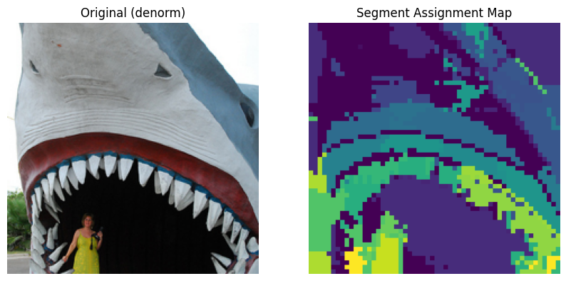
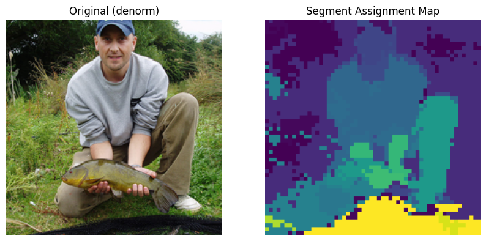
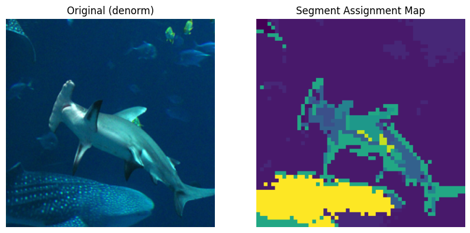
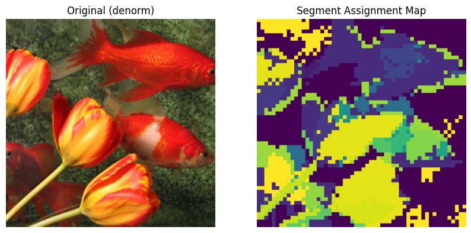

# Native Segmentation Vision Transformer

Unofficial implementation of the paper [Native Segmentation Vision Transformer](https://arxiv.org/pdf/2505.16993).

This repository was built because I could not find an official open-source implementation when reproducing the paper. The project started from a cloned Swin Transformer codebase, but the implementation here was heavily modified to reproduce the Native Segmentation Vision Transformer idea in this repository.

`main.py` is the main training and evaluation entry point.

## Notes

- This is not the official code release from the paper.
- The codebase was originally bootstrapped from Swin Transformer and then substantially changed.
- The commands below use repository-relative config paths. Replace checkpoint and dataset paths with the ones from your environment.

## Result

- ImageNet-1K validation Top-1: `76.150%`
- ImageNet-1K validation Top-5: `93.445%`
- Best recorded accuracy in log: `76.27%`

These numbers are from `output/Senatra/default/log_rank2.txt`.

## Pretrained Checkpoint

A trained checkpoint can be downloaded from Google Drive:

[Download `.pth` checkpoint](https://drive.google.com/file/d/1kH9YIwW8MOjCgZIUofOdRvsuAGoed3BQ/view?usp=drive_link)

After downloading the `.pth` file, you can plug its path into `--resume` and run evaluation or visualization immediately.

## Markov Assignment Chain Samples

Below are sample outputs generated by `markov_grouped_save.py` and saved in `segmentation/assignment_chain/`.

<p align="center">
  
  
</p>
<p align="center">
  
  
</p>

## Training And Evaluation

Single-GPU training:

```bash
CUDA_VISIBLE_DEVICES=1 python -m torch.distributed.launch \
  --nproc_per_node 1 \
  --master_port 1215 \
  main.py \
  --cfg configs/swin/Senatra.yaml \
  --data-path /path/to/imagenet \
  --batch-size 128
```

Single-GPU evaluation with a trained checkpoint:

```bash
CUDA_VISIBLE_DEVICES=1 python -m torch.distributed.launch \
  --nproc_per_node 1 \
  --master_port 1215 \
  main.py \
  --eval \
  --cfg configs/swin/Senatra.yaml \
  --resume /path/to/ckpt_epoch_23.pth \
  --data-path /path/to/imagenet
```

## DDP Guide

This project uses PyTorch distributed launch even for 1 GPU. If you want to run DDP, keep the same command structure and only scale the GPU-related arguments.

- Set `CUDA_VISIBLE_DEVICES` to the GPUs you want to use.
- Set `--nproc_per_node` to the number of visible GPUs.
- Keep `--cfg`, `--data-path`, and `--resume` in the same form.
- `--batch-size` is the per-GPU batch size.
- Choose a free `--master_port`.

Example: 4-GPU DDP training

```bash
CUDA_VISIBLE_DEVICES=0,1,2,3 python -m torch.distributed.launch \
  --nproc_per_node 4 \
  --master_port 1215 \
  main.py \
  --cfg configs/swin/Senatra.yaml \
  --data-path /path/to/imagenet \
  --batch-size 128
```

Example: 4-GPU DDP evaluation

```bash
CUDA_VISIBLE_DEVICES=0,1,2,3 python -m torch.distributed.launch \
  --nproc_per_node 4 \
  --master_port 1215 \
  main.py \
  --eval \
  --cfg configs/swin/Senatra.yaml \
  --resume /path/to/ckpt_epoch_23.pth \
  --data-path /path/to/imagenet
```

If you are using PyTorch 2.x, the same pattern can also be launched with `torchrun` because `LOCAL_RANK` is read from the environment in this codebase.

## Visualization From Trained Checkpoints

Two scripts are included for visualization from trained `.pth` checkpoints.

### 1. `markov_grouped_save.py`

- Loads a trained checkpoint and visualizes the Markov-chain-composed `A_ups`.
- Results are saved to `segmentation/assignment_chain/`.

Example:

```bash
CUDA_VISIBLE_DEVICES=1 python -m torch.distributed.launch \
  --nproc_per_node 1 \
  --master_port 1215 \
  markov_grouped_save.py \
  --eval \
  --cfg configs/swin/Senatra.yaml \
  --resume /path/to/ckpt_epoch_23.pth \
  --data-path /path/to/imagenet \
  --batch-size 32
```

### 2. `markov_segmentation_grouped_save.py`

- Loads a trained checkpoint and visualizes the class projection map derived from the segmentation tokens.
- Results are saved to `segmentation/class_projection/`.

Example:

```bash
CUDA_VISIBLE_DEVICES=1 python -m torch.distributed.launch \
  --nproc_per_node 1 \
  --master_port 1215 \
  markov_segmentation_grouped_save.py \
  --eval \
  --cfg configs/swin/Senatra_segmentation.yaml \
  --resume /path/to/ckpt_epoch_23.pth \
  --data-path /path/to/imagenet \
  --batch-size 32
```

## Acknowledgement

This repository is based on a cloned Swin Transformer codebase and was heavily modified for this unofficial Native Segmentation Vision Transformer implementation.
